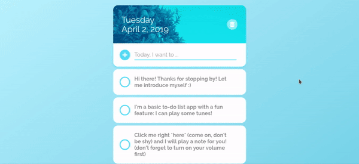
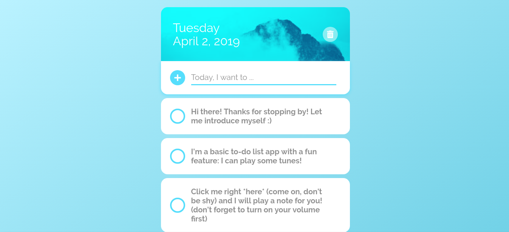
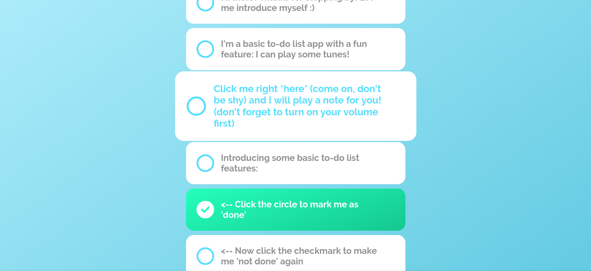
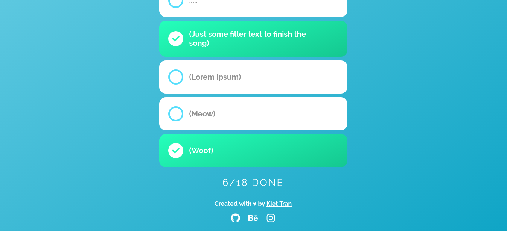

# Tune Do

A simple to-do list app that plays music when you click on each to-do tab.

Built with React ⚛️ (my first React app :innocent:).

## See it in action!

<https://tune-do.herokuapp.com>

## Screenshots

<p align="center">
  
</p>

<p align="center">
  
  
  
</p>

## How to compile and run the source code

### Prerequisites

You must have **Node.js (npm)** installed on your computer. 

### Instructions

From your Terminal/Command Prompt, run the following commands:

1. Clone this repo into your computer and `cd` into the program's directory:

```
git clone https://github.com/kietatr/tune-do.git
cd tune-do
```

2. Make sure you have **Node.js** (**npm**) installed first. Install dependencies:

```
npm install
```

3. Run the program:

```
npm start
```

If any of these steps are unclear, you can refer to the [React documentation](https://reactjs.org/) for further instructions.
